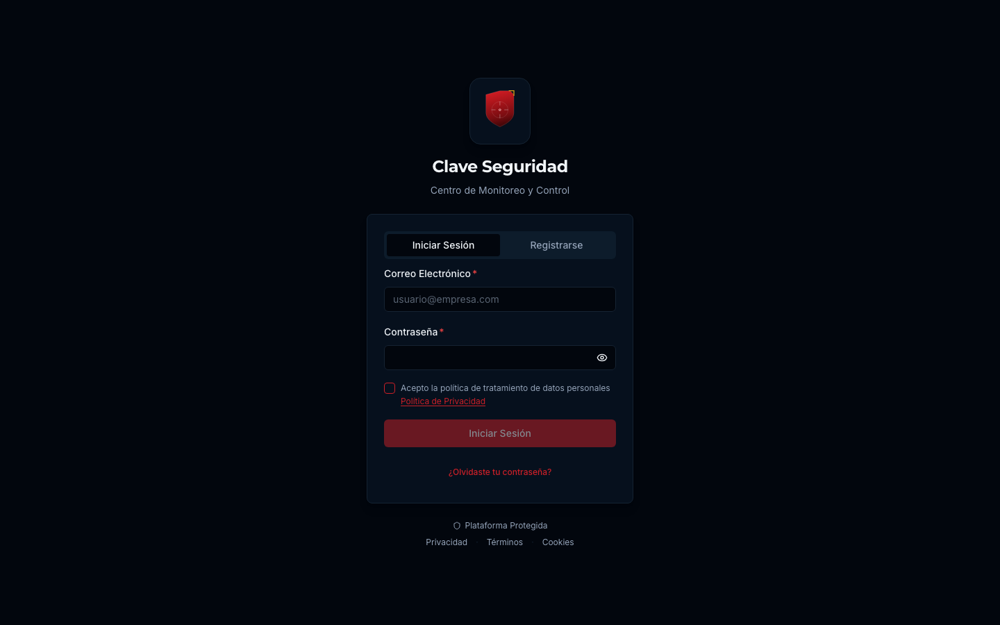

# Auditoría Inicial UX/UI - AION Vision Hub
**Fecha:** 2026-04-19
**Evaluador:** Senior UX/UI Developer

## 1. Screenshots (Estado Actual)

| Página | Screenshot |
|--------|------------|
| Dashboard |  |
| Live Streams |  |
| Live View |  |
| Access Doors |  |
| Devices |  |
| Alarms/Events |  |

---

## 2. Inconsistencias Visuales y Funcionales

### Branding y Tipografía
- **Nomenclatura y Logos:** A pesar de ser "AION Vision Hub", la página de inicio de sesión, el footer y ciertos tooltips aún muestran la marca antigua "Clave Seguridad".
- **Tipografía:** Existen variaciones de tamaño y peso de fuente que no se alinean completamente con las utilidades de tipografía de Tailwind en todo el proyecto.
- **Iconografía:** Algunas pantallas usan una mezcla de estilos de íconos o faltan íconos representativos en los estados vacíos.

### Colores fuera del Design System
Se encontraron colores hardcodeados que deben migrarse a semantic tokens. Algunos ejemplos:
- `text-[#...]` y `bg-[#...]` encontrados en archivos como `SitePortalPage.tsx`, `TVDashboardPage.tsx`, `WallPage.tsx`, y `SmartCameraCell.tsx`.
- Estos valores estáticos impiden el correcto funcionamiento del dark mode y la coherencia del tema general.

### Estados Vacíos (Empty States) Faltantes
- Cuando el backend no está disponible o no hay datos (ej: fallos en los fetches de `/api/cameras`, `/api/devices`), las áreas de contenido principales quedan completamente en blanco o muestran el color de fondo por defecto sin ningún mensaje de estado o feedback al usuario.
- **Falta de componentes dedicados:** No se observan ilustraciones de `lucide-react` claras acompañadas de llamadas a la acción (CTA) tipo "Reintentar" o explicaciones amigables sobre por qué no hay datos.
- **Estados de carga:** En lugar de utilizar los skeletons de `shadcn/ui`, algunas páginas simplemente retrasan el renderizado o usan spinners genéricos.

### Componentes Duplicados o Inconsistentes
- Las tarjetas (Cards) de información y los badges de estado difieren en padding y border-radius según la página (Dashboard vs Devices vs Access Doors).
- El menú lateral tiene etiquetas que no coinciden con la nueva nomenclatura (ej. "Detecciones" en lugar de "Alarms/Events", "Salud de Cámaras" en lugar de "Devices").

---

## 3. Lista de Accesibilidad (a11y)

### Contraste (WCAG AA)
- Existen alertas, como el badge de "conexión lenta" (yellow) sobre fondo oscuro, que no cumplen con los ratios de contraste recomendados por WCAG AA.
- Algunos textos secundarios (`text-muted-foreground`) en tarjetas de estados anidados carecen de suficiente legibilidad contra los fondos de los componentes tipo Card.

### Focus States (Navegación por Teclado)
- Si bien la navegación con Tab funciona, el `focus-visible` ring de varios elementos interactivos (botones en grids, accesos rápidos de cámaras) es muy sutil o inexistente.
- Falta un enlace `Skip to main content` (saltar al contenido principal) al inicio del DOM para usuarios de lectores de pantalla.

### Aria-Labels
- Múltiples botones que solo tienen íconos (como el toggle del sidebar, acciones rápidas de las puertas, controles HLS del reproductor) carecen de atributos `aria-label` descriptivos. Esto afecta severamente el soporte para screen readers.

### Animaciones (prefers-reduced-motion)
- Los modales, tooltips y transiciones de páginas no parecen respetar universalmente la query `@media (prefers-reduced-motion: reduce)`, lo cual es necesario para cumplir estándares avanzados de accesibilidad.

---

**Siguiente paso:** Completar la fase [2] (Design System Tokens) y migrar los colores hardcodeados hacia variables semánticas en `tailwind.config.ts` y archivos `.css`.
